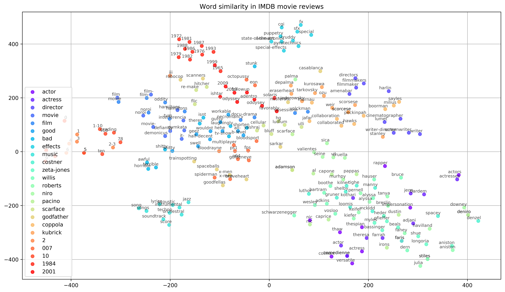

# Topic Clustering from Word Embeddings for IMDB Movie Reviews
.
The aim of this work is twofold. Firstly, to build a Word2Vec-powered word embedding model for the well-known Internet Movie Database (IMDB) [movie reviews dataset](https://ai.stanford.edu/~amaas/data/sentiment/), testing a large number of parameter configurations. The embeddings produced by each configuration are used to form word clusters that are evaluated using internal clustering metrics. Secondly, the word embeddings model that is determined to have the best-separated clusters is used to visualize a set of key words in the domain of the data set (movies), along with the words that the model considers of higher semantic similarity to them. The objective is to prove in a visually simple way how the model is able find relations between words, making it obvious even for an audience not familiar with machine learning.

| | |
|-|-|
| **Programming language** | Python 3 |
| **Author** | Albert Espín |
| **Date**  | April 2019  |
| **Code license**  | MIT |
| **Report license**  | Creative Commons Attribution, Non-Commercial, Non-Derivative |

